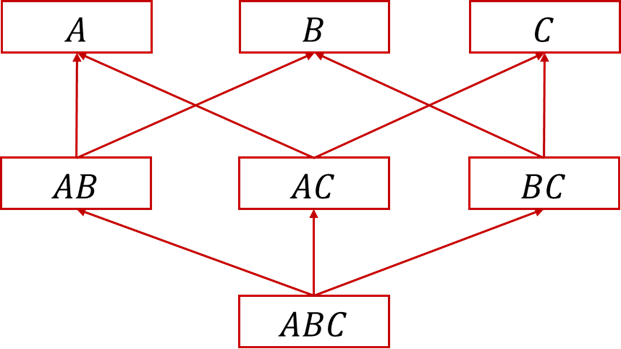

# PKU-Database-Project-4

性能调优在数据库项目开发和维护中非常重要，涉及到数据库方方面面的知识。通过性能调优，可以由外及内地了解数据库系统内部的实现技术，所以是很好地学习数据库内核的途径。

本次实习我们设计如下几个调优任务：

1. 索引调优

2. 特定任务调优

3. SQL Hint调优

4. 事务调优

## 任务一、索引调优

索引在数据库中至为重要，创建合适的索引是提高查询性能的决定性因素，因此数据库提供了各种类型的索引。这个实习就是让同学们直观体会索引所带来的查询性能的提升。

首先创建一个testIndex(id, A, B, C)，在下面的实验中，请自行填充相关列的数据，记录所填充的不同数据规模下的索引效果。

1. A是整型，针对A列的分组和自连接操作，观察A列上建立索引前后的性能差异；
2. B是整型，针对select B where A类型的查询，观察基于(A, B)的组合索引相对于A上的单列索引的性能提升；
3. C是字符串，观察函数索引的作用。

比如Create index funcIdx on testIndex(Substring(C, 2, 3));

它对于select from where Substring(C, 2, 3)='ABC'起作用

而对于select from where Substring(C, 2, 2)='AB'则不起作用

另一个实际场景例子：有一个login表，其中有两列role_id和org_id, 有一个查询条件是where concat(role_id, '#', org_id)='123#abc',显然role_id和org_id上的索引对这个查询无效，需要建立针对concat的函数索引。

同学们可以根据上面两个用例，选取一个来探索函数索引的效果。

## 任务二、特定问题的不同实现策略比较

1、最大并发间隔问题，如下图所示：

对于最大并发间隔，分别有基于集合、游标、窗口函数三种不同的解决方案。请产生一个报告，生成不同规模的数据集，比较三种方法的性能，分析其执行计划。你所产生的报告核心是一个图表，横轴是数据规模，纵轴是运行时间，画出不同解决方案的折线图。

这个实习的目的有二：一是了解同一个问题的不同实现途径，一是掌握如何搜集性能相关的运行数据。

可以设置一个表sessions(id, start_time, end_time)，模拟用户的登录时间段，然后借助大模型产生模拟数据。

## 任务三、物化视图

考虑一个testGroupby(A, B, C)表，它所有可能的group by语句的分组属性级有$\{ \{A\}, \{B\}, \{C\}, \{AB\}, \{AC\}, \{BC\}, \{ABC\} \}$，这些属性组之间存在包含关系，比如$\{A\}\subseteq\{AB\}, \{A\}\subseteq\{AC\}$。这些包含关系意味着子属性集可以由父属性集的结果计算得来。比如group by A，既可以从原表中直接计算出来，也可以从group by A,B或group by A,C的结果中计算得来。所以如果我们能保存某些group by的结果，用它来支持其它子属性集的分组操作，那么可以获得更快的执行性能。

如果我们设定缓存的大小，问题就变成针对一个给定的分组查询集合，物化哪些group by的结果可以使得总的IO数最小。

我们形式化地描述这个问题（注意：下面的步骤都是要用SQL完成的）：

1. 创建表testGroupby(A, B, C, D)，设置各属性取值范围分别为1~10, 1~100, 1~1000, 1~10000，除去空集，应该有15个分组属性集.

2. 往表里填充50~100万行数据，这个可以请大模型帮着生成插入模拟数据的脚本，比较简单。

3. 查询出15个分组属性集结果的行数，并记入一个表attrSets(attrCode, cardinality) 中，对应着属性集编码和行数。

4. 随机产生一个工作负载集workloads，里面包含着若干分组查询。可以从第3步里面的attrSets中随机产生若干行作为负载集。

5. 针对这个负载集，在一定缓存空间的限制下，选取物化哪些分组的查询结果会使得整体的IO数量最小？

6. 尝试不同的负载集和不同缓存空间的大小，对比一下结果。

7. （选做）讨论这个通用的解法是什么？
